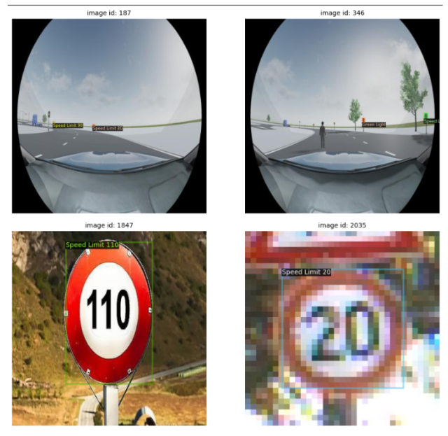

# Traffic Sign Classification using CNN

## Overview
This project implements a **Convolutional Neural Network (CNN)** to automatically detect and classify traffic signs. Traffic sign recognition is a critical technology for Intelligent Transportation Systems (ITS) and self-driving vehicles. Using the **German Traffic Sign Recognition Benchmark (GTSRB)** dataset, this model distinguishes between 43 different classes of traffic signs. The final model achieves a classification accuracy of approximately **95%**.



## Dataset
The project uses the GTSRB dataset, which is a multi-class, single-image classification challenge.
- **Total Images:** 50,000+ images.
- **Classes:** 43 different traffic signs.
- **Source:** [Kaggle GTSRB Dataset](https://www.kaggle.com/datasets/meowmeowmeowmeowmeow/gtsrb-german-traffic-sign)

## Model Architecture
The solution uses a Sequential CNN built with TensorFlow/Keras. The architecture is designed to extract features like shape and color.

- **Input Layer:** 30x30 pixels, 3 channels (RGB).
- **Convolutional Layers:** * 2x Conv2D (32 filters, 5x5 kernel, ReLU) + MaxPool2D + Dropout (0.25)
    - 2x Conv2D (64 filters, 3x3 kernel, ReLU) + MaxPool2D + Dropout (0.25)
- **Fully Connected Layers:**
    - Dense (256 units, ReLU) + Dropout (0.5)
    - Output Layer (43 units, Softmax)

## Results
The model was trained for 25 epochs.
- **Training Accuracy:** ~95%
- **Test Accuracy:** 95.4%
- **Loss:** ~0.20

## Installation & Usage

1.  **Clone the repository**
    ```bash
    git clone [https://github.com/citakamaliaa/traffic-sign-detection-fastrcnn.git](https://github.com/citakamaliaa/traffic-sign-detection-fastrcnn.git)
    cd traffic-sign-detection-fastrcnn
    ```

2.  **Install dependencies**
    ```bash
    pip install -r requirements.txt
    ```

3.  **Run the Notebook**
    * Download the `GTSRB.zip` from Kaggle.
    * Open `traffic_sign_cls.ipynb`.
    * Update the dataset path in the notebook to point to your local file.
    * Run all cells to train and evaluate the model.
